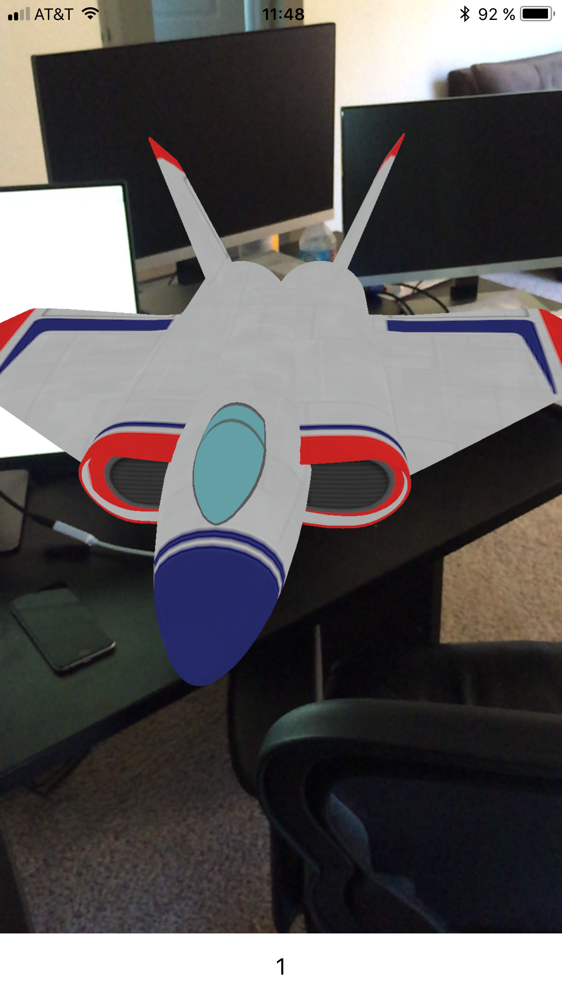
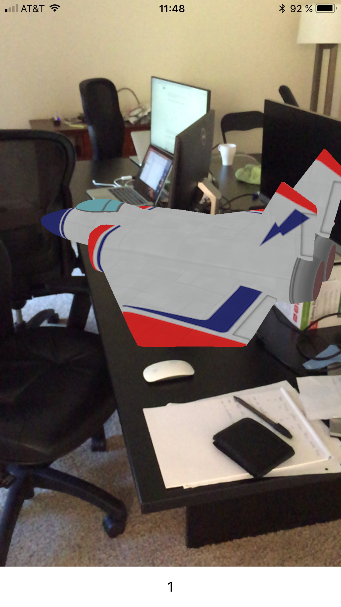

#  ARKitSpaceship

Super simple project to understand how rendering works with ARKit.

### What it does?

- Creates an ARKit Session
- Displays a ship on a random location once a plan has been detected
- Removes a ship once is touched, increment the counter and render another ship

